# WSI_handling
Code for handling digital pathology pyramidal whole slide images (WSIs). Currently works with annotation XMLs from Aperio ImageScope or annotation json's from QuPath and image formats supported by Openslide.

Supports getting a tile from a WSI at the desired micron-per-pixel (mpp), getting either the whole WSI or an annotated region, generating a mask image for either a tile or the WSIs, and showing the location of a tile on the WSI.

# Annotation format
Example annotations are provided in ./example_annotations

XML annotations must follow the AperioImagescope format:

```xml
<?xml version="1.0" encoding="UTF-8"?>
<Annotations>
<Annotation LineColor="65280">
<Regions>
<Region>
<Vertices>
<Vertex X="56657.4765625" Y="78147.3984375"/>
<Vertex X="56657.4765625" Y="78147.3984375"/>
<Vertex X="56664.46875" Y="78147.3984375"/>
</Region>
</Regions>
</Annotation>
</Annotations>
```

With more \<Annotation\> or \<Region\> blocks for additional annotations.

json annotations must follow QuPath's json export format:

```
[
  {
    "type": "Feature",
    "id": "PathAnnotationObject",
    "geometry": {
      "type": "Polygon",
      "coordinates": [
        [
          [76793.51, 4613.02],
          [76651.56, 4684],
          [76580.59, 4684],
          [76580.59, 4754.97]                   
        ]
      ]
    },
    "properties": {
      "classification": {
        "name": "Tumor",
        "colorRGB": -3670016
      },
      "isLocked": true,
      "measurements": []
    }
]
```

# Installation

pip install WSI_handling

# Usage
```python
import matplotlib.pyplot as plt
from WSI_handling import wsi
```


```python
img_fname=r'/mnt/ccipd_data/TCGA_PRAD/2018Jan14/TCGA-EJ-5519-01Z-00-DX1.svs'
xml_fname=r'./example_annotations/TCGA-EJ-5519-01Z-00-DX1.xml'
w = wsi(img_fname,xml_fname)
```


```python
plt.imshow(w.get_wsi(desired_mpp=8));
```


    
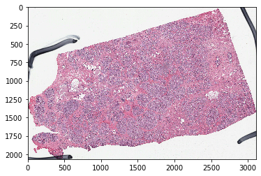
    


```python
plt.imshow(w.mask_out_annotation(desired_mpp=8));
```


    
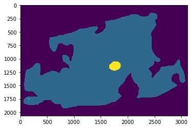
    


```python
plt.imshow(w.get_annotated_region(desired_mpp=2,colors_to_use='other',annotation_idx='largest')[0]);
```


    
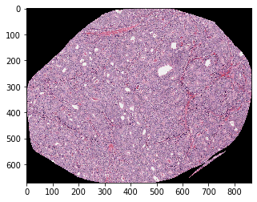
    


```python
plt.imshow(w.get_annotated_region(desired_mpp=2,colors_to_use='red',annotation_idx='largest')[0]);
```


    
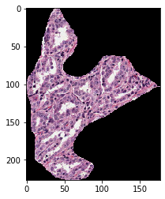
    


```python
img, mask = w.get_annotated_region(desired_mpp=8,colors_to_use='green',annotation_idx='largest',mask_out_roi=False)
plt.imshow(img);
plt.show()
plt.figure
plt.imshow(mask);
```


    
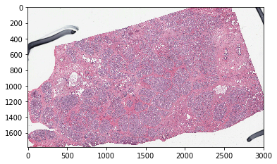
    


    
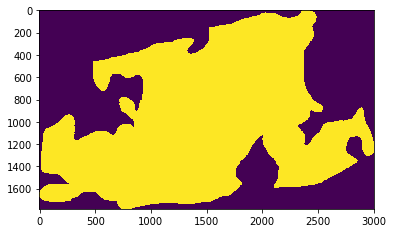
    


```python
plt.imshow(w.get_tile(desired_mpp=1,coords=(3400,54000),wh=(2000,2000)))
```


    <matplotlib.image.AxesImage at 0x7f95cdbe4668>


    
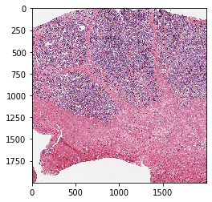
    


```python
plt.imshow(w.mask_out_tile(desired_mpp=1,coords=(3400,54000),wh=(2000,2000)))
```


    <matplotlib.image.AxesImage at 0x7f95cdbf9ac8>


    
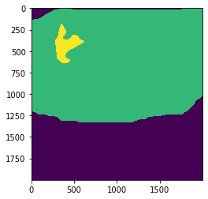
    


```python
plt.imshow(w.show_tile_location(desired_mpp=1,coords=(3400,54000),wh=(2000,2000)))
```


    <matplotlib.image.AxesImage at 0x7f95cec802b0>


    
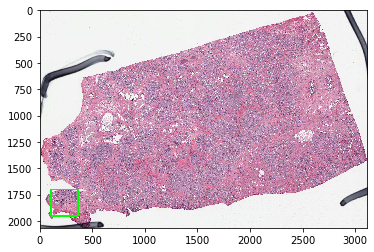
    


```python
img_fname=r'/mnt/ccipd_data/TCGA_PRAD/2018Jan14/TCGA-EJ-5519-01Z-00-DX1.svs'
xml_fname=r'./example_annotations/TCGA-EJ-5519-01Z-00-DX1.json'
w = wsi(img_fname,xml_fname)
```


```python
plt.imshow(w.mask_out_annotation(desired_mpp=8,colors_to_use=['tumor','other']));
```


    
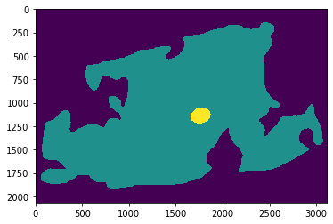
    


```python
plt.imshow(w.get_annotated_region(desired_mpp=2,colors_to_use=['tumor'],annotation_idx='largest')[0]);
```


    
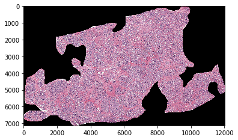
